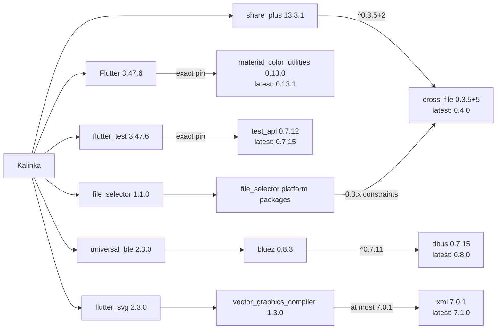

# Dependency upgrade audit

Audited on 8 October 2026 with Flutter 3.47.6 and Dart 3.13.5.

The upgrade reduces packages with newer incompatible versions from **31 to 5**.
All direct hosted dependencies are at their latest stable versions in the audited
resolution. The remaining five are transitive dependencies constrained by Flutter
or by packages that are already current. No dependency overrides are used.

## Dependency usage

Application imports, generated code, tooling configuration, platform dependencies,
and release assets were checked before considering removal. No direct dependency
could safely be removed from the final configuration:

- `cupertino_icons` supplies a font referenced by the compiled Flutter UI even
  without application-level `CupertinoIcons` imports. A web release build without
  it reported a missing font. With version 2.0.0 the warning disappears and the
  font is reduced to 1,472 bytes by icon tree shaking.
- `json_annotation` supports the generated JSON serializers and is also exposed
  through `freezed_annotation`; the JSON generator requires its direct declaration.
- `build_runner`, `freezed`, `json_serializable`, and `flutter_lints` are used by
  code generation and analyzer configuration rather than application imports.
- The other packages are used by application code, tests, or platform features.

`cross_file` supplies `XFile`, a cross-platform file abstraction. The log exporter
constructs an `XFile` from ZIP bytes for the Android share sheet through
`share_plus`. It also appears through the file-selector platform packages.

## Upgrades that removed blockers

| Area | Change | Required project changes |
| --- | --- | --- |
| SDK | Flutter 3.44.8 → 3.47.6; Dart minimum 3.13 | Update both CI workflows and SDK constraints; migrate the catalog heading to `Semantics(headingLevel: 1)` |
| Freezed | 3.x → 4.0.2 | Regenerate three model libraries; existing sealed factory unions remain compatible |
| Generation | `build_runner` 2.16.2, `json_serializable` 6.14.1, `json_annotation` 4.12.0 | Resolve the newer analyzer/build/source-generation chain and regenerate models |
| Platform plugins | `share_plus` 13.3.1; `package_info_plus` 10.2.2 | Raise major-version constraints; current application calls remain compatible |
| Icons | `cupertino_icons` 2.0.0 | Retain the font dependency and verify release asset generation |
| Lints | `flutter_lints` 6.0.0 | Use wildcard parameters, null-aware collection elements, and explicit public Riverpod `Override` return types |
| Android build | AGP 8.13.0 → 9.0.1; regenerate the Gradle 9.1.0 wrapper | Enable built-in Kotlin and retain the current wrapper's Java native-access declaration |
| Other direct dependencies | Raise constraints to the audited latest stable versions | Verify analysis, tests, and platform builds |

Freezed 4's Dart requirement is why upgrading package constraints alone on the old
SDK was insufficient. The newer SDK and generators also allow newer analyzer,
build, formatting, package configuration, and native plugin dependencies to resolve.
Generated JSON serializers and protocol formats are unchanged; no corresponding
backend change is required.

## Remaining blockers

For every row below, `current`, `upgradable`, and `resolvable` from
`flutter pub outdated --json` are identical. Changing only root version
constraints therefore cannot upgrade these packages further.

| Package | Resolved | Latest stable | Blocking constraint |
| --- | --- | --- | --- |
| `cross_file` | 0.3.5+5 | 0.4.0 | `share_plus` 13.3.1 requires `^0.3.5+2`; file-selector platform packages also require 0.3.x |
| `dbus` | 0.7.15 | 0.8.0 | `universal_ble` 2.3.0 → `bluez` 0.8.3 → `dbus ^0.7.11` |
| `material_color_utilities` | 0.13.0 | 0.13.1 | Exact pin in Flutter 3.47.6 |
| `test_api` | 0.7.12 | 0.7.15 | Exact pin in `flutter_test` from Flutter 3.47.6 |
| `xml` | 7.0.1 | 7.1.0 | `flutter_svg` 2.3.0 → `vector_graphics_compiler` 1.3.0 → `xml >=6.3.0 <=7.0.1` |

These require upstream releases relaxing the constraints, or a separately tested
migration to replacements or forks. Their owning packages are already at the
latest stable versions in this audit.

## Validation

- `dart run build_runner build` completed successfully; three tracked Freezed
  files changed and the generated JSON serializers stayed unchanged.
- `flutter analyze` passed with no issues.
- `flutter test` passed all **1,067 tests**, including all five catalog goldens
  and the assertion that the catalog title exposes heading level 1.
- Android debug and release APK, web release, and Linux release builds succeeded.
- All **81 Android unit tests** and **8 Bonjour discovery tests** passed after
  the Android build migration.
- `flutter pub upgrade --dry-run` proposed no changes.
- `flutter pub outdated --json` reported only the five transitive packages above.

The five golden baselines were visually reviewed and refreshed for Flutter
3.47.6. Differences are limited to rounded-border rasterization (approximately
0.05–0.34% of pixels per image), with no layout or text changes. Pixel comparison
was not relaxed. Failure PNGs from the earlier run are local diagnostic artifacts,
not active test failures or files included in this change.

Windows and Apple builds were not run on the Linux host.

## Android build compatibility

AGP is now 9.0.1 with built-in Kotlin enabled, following the
[Flutter migration guide](https://docs.flutter.dev/release/breaking-changes/migrate-to-built-in-kotlin/for-app-developers).
Flutter 3.47 still requires `android.newDsl=false`; its dependency validation
remains enabled. The app no longer applies the legacy Kotlin Android plugin.

The latest `nsd_android` release, 2.2.0, still applies that legacy plugin. The
version-specific `android/compat/nsd_android` build configuration compiles its
published Kotlin sources and manifest with AGP's built-in Kotlin. It does not
modify the pub cache, fork the package, or override Dart dependency resolution.
Only version 2.2.0 uses this adapter; newer versions use their own build scripts.
Remove the adapter when the upstream package completes its migration.

The Gradle 9.1.0 wrapper scripts and JAR are now checked in together. The old
launcher used a classpath invocation; the current generated launcher uses the
wrapper JAR's `Enable-Native-Access: ALL-UNNAMED` manifest declaration. This
resolves the Java 25 native-library warning without changing the system JDK.
The wrapper JAR was verified against Gradle's published SHA-256 checksum and the
distribution checksum is pinned in `gradle-wrapper.properties`.

AGP 9's unit-test APK packaging explicitly depends on Flutter's asset-copy task
so Robolectric receives generated assets in the correct order. Its forked test
JVM also enables native access for the Conscrypt provider. Both debug and release
APK builds complete without the Java native-access or outdated-AGP warnings.

The repository's existing policy ignores `pubspec.lock`. These results describe
the audited resolution; future package releases can change the exact versions
selected by the compatible constraints.
